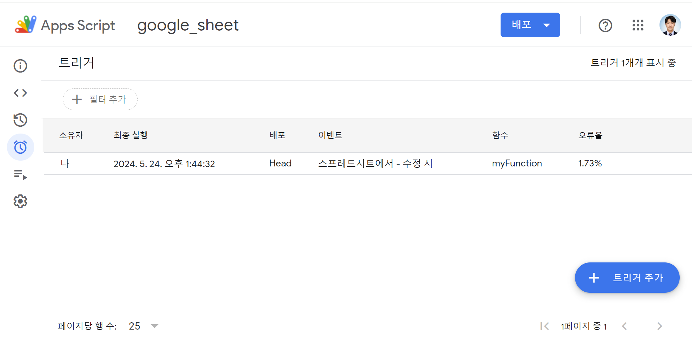
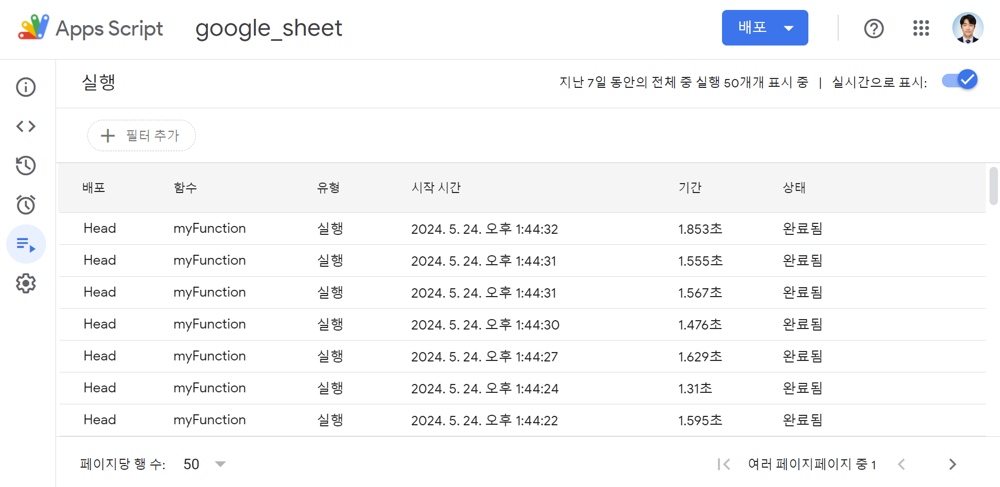

## Intro
저번 Google Sheets API에 이어서, 이번엔 Google Apps Script이다.   
난 시트 내에서 계산식이 자동으로 다음줄에도 계산이 되어야한다는 요구사항을 받았다.   
그래서 여러 방법을 고민하기 시작했다...   
1. **Google Sheets** 내의 함수나 기능 활용하기
2. **Java/Javascript** 로 가져와서 계산식을 적용하고 다시 뿌려주기
3. **Apps Script** 활용하기  

1번은 찾지 못했다. 2번은 작성해야 하는 코드가 많아서 번거로웠다. 그래서 나는 3번인 Apps Script를 활용하기로 결정했다.  
**앱 스크립트(App Script)** 는 구글 워크스페이스 플랫폼에서 가벼운 애플리케이션 개발을 위해 구글이 개발한 스크립팅 플랫폼이다.  
난 이걸 활용하여 자동으로 계산식에 이어서 계산이 되는 기능을 구현하고자 한다.  
  
하지만 난 Apps Script가 처음이기 때문에 어떻게 접근해야할 지 몰랐다.  
그러다 팀장님이 귀뜸해주신 말씀에 도움을 얻어서 매크로를 활용했다.  
매크로를 기록하고 관리 페이지에서 스크립트 수정이 가능하다.  이걸로 관련 함수와 구현 방법에 대해 익숙해질 수 있었다.  
  
## 구현 로직
```
스프레드 시트 연결 -> 특정 범위 지정 -> 비어 있지 않은 셀 찾기 -> 마지막 셀 찾기 -> 연산 수행
```
 
  
### 1) 스프레드 시트 연결
```javascript 
var spreadsheet = SpreadsheetApp.getActive();  
```
가장 먼저 스프레드 시트와 연결을 해야하는데 확장 프로그램이다 보니, ```Google Sheets API```처럼 복잡한 코드가 아니다.
### 2) 특정 범위 지정
```javascript 
var range = spreadsheet.getRange('범위(B2:C3)');  
  
var numRows = range.getNumRows();
var numCols = range.getNumColumns();
```
범위를 지정해야 기준이 생긴다.
> 그렇다면 범위는 무작정 작게 하는게 좋을까? 무작정 크게 늘려 놓는게 좋을까?
### 3) 비어 있지 않은 셀 찾기
```javascript 
var nonEmptyCells = [];
  
// 지정한 범위 내에서 비어 있지 않은 셀을 찾아 nonEmptyCells 배열에 추가
for (var row = 1; row <= numRows; row++) {
    for (var col = 1; col <= numCols; col++) {
        var cellValue = range.getCell(row, col).getValue();
        if (cellValue !== "") {
            nonEmptyCells.push({row: row, column: col});
        }
    }
}
```
값이 있다면 어떤 값이 어느 위치에 있는지 배열에 담아두는 것이다.
> 그러다 빈 값이 나오겠지?
### 4) 마지막 셀 찾기
```javascript 
if (nonEmptyCells.length > 0) {
    var firstCell = nonEmptyCells[0];
    var lastCell = nonEmptyCells[nonEmptyCells.length - 1];
    console.log("비어 있지 않은 셀의 범위: " + range.getCell(firstCell.row, firstCell.column).getA1Notation() + " - " + range.getCell(lastCell.row, lastCell.column).getA1Notation());    
    
    try {
        var lastRangeCell = range.getCell(lastCell.row, lastCell.column + 1).getA1Notation();
        var inputRange = 'G3:' + lastRangeCell;
        console.log("가장 마지막 셀 : " + lastRangeCell);
        
        ...

    } catch (e) {
        ...
    }
}
```
거기가 마지막 셀, 하지만 그 다음줄에 또 이어지면 계속 빈 값을 무시하고 이어진다.
### 5) 연산 수행
```javascript 
var currentCell = spreadsheet.getCurrentCell();        
var nowColumn = currentCell.getColumn();
var currentCellAlpha = currentCell.getA1Notation();

if (nowColumn == 6 && currentCell.getValue() !== "") {
    spreadsheet.getRange('수식이 있는 셀(D2)').activate();
    spreadsheet.getActiveRange().autoFill(spreadsheet.getRange(inputRange), SpreadsheetApp.AutoFillSeries.DEFAULT_SERIES);   
    spreadsheet.getRange(currentCellAlpha).activate();
    console.log("현재 선택한 셀 : " + currentCellAlpha);
}
```
다 찾았으면 autoFill()을 활용하여 수식을 채워넣는다.

## 트리거
  

위에서 코드를 다 작성했다면, 자동으로 코드가 실행되어야 하기 때문에 **트리거** 를 사용한다.  
사진에서 보이는 것과 같이 트리거를 추가할 수 있고,  
어떤걸 배포하고 어떤 이벤트에서 실행되며 어떤 함수를 실행시킬 것인지 모두 설정할 수 있다.  
> 저렇게 오류율이 조금 발생한 것은 내가 try-catch문에서 catch를 해주지 않았기 때문이다...  

저렇게 설정해두면, 스프레드를 수정하고 자동으로 저장이 될 때 수정이 된 시점으로 인식하여 트리거가 작동하게 된다.  


이렇게 실행된 결과도 힌 눈에 볼 수 있다.

## 나의 소감
**Google Sheets API** 에 이어서 **Apps Scripts** 까지 해보니, 현업에서 고민되었던 문제를 해결할 수 있다는 사실에 벅찼다.  
새로운 것들이었기 때문에 하나하나 알아가는 과정이 지루하지 않고 재밌었다.  
다만 아직 **Apps Script** 에서 javascript에 익숙하지 않아서 클린코드, 객체지향적인 코드 작성을 했다고 말할 수는 없지만,  
그래도 그걸 적용하고 나름대로 추출해보는 경험이 즐거웠다.  
**Apps Script** 도 하나의 문제 해결 방법으로 고려해볼만 한 것 같다.

```toc

```