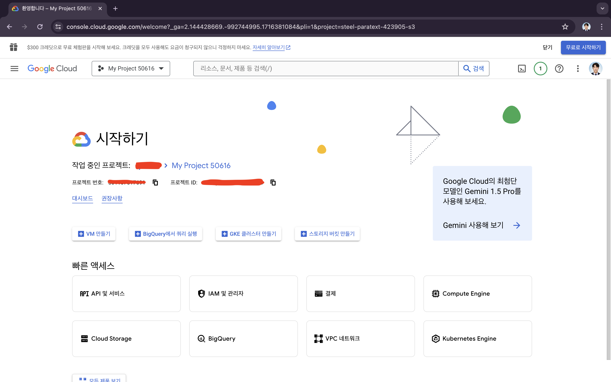
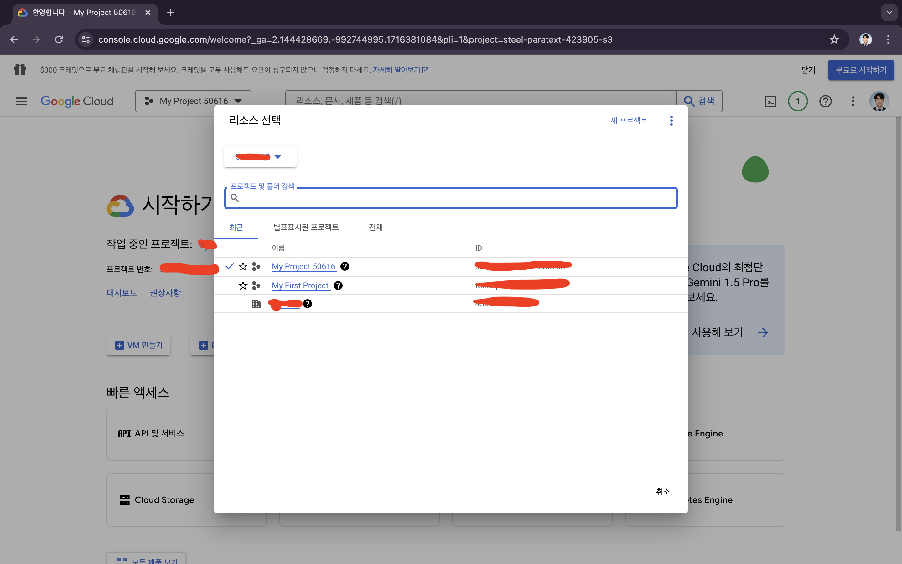
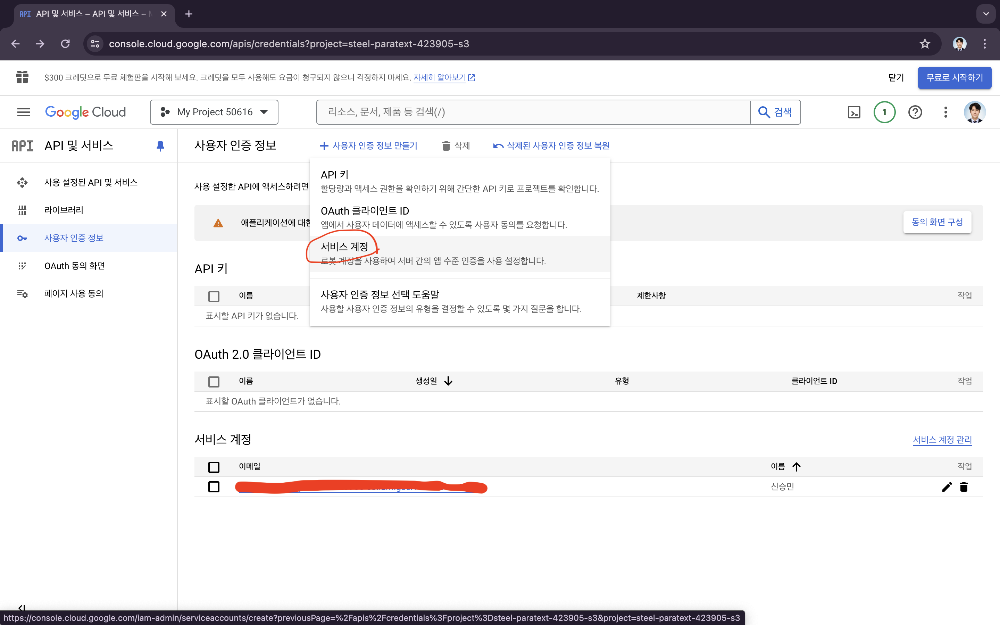
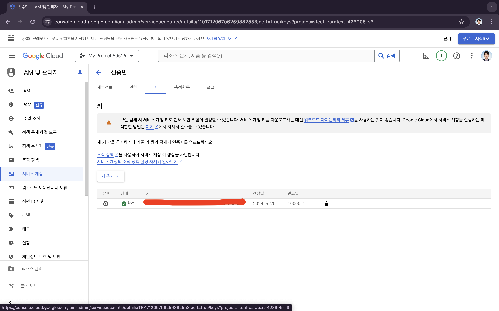
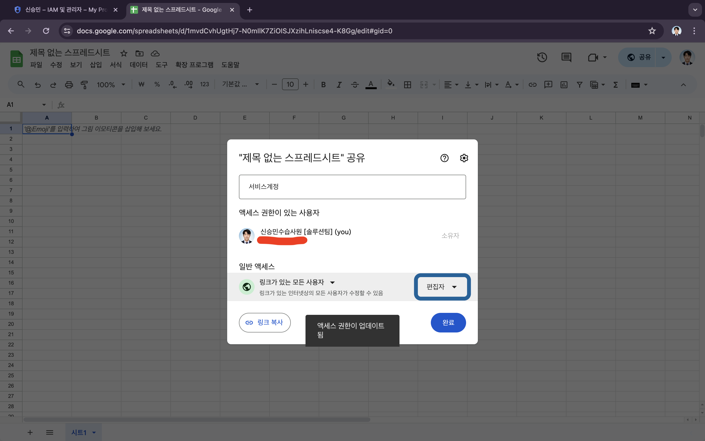

## Intro
회사에서 수습사원을 떼고, 첫 업무가 주어졌다!!!   
유관부서에서 Google Sheets로 대시보드처럼 사용하고 있었는데,   
Google Sheets에서 편집한게 우리가 사용하는 웹 사이트에도 보였으면 좋겠다는 요구였다. 정리해보자!   
   
   1. Google Sheets가 DB에 연동이 되어야한다.
   2. Google Sheets에서 계산식이 자동으로 적용되어야 한다.
   3. Google Sheets에서 변경된 내용은 웹사이트에도 반영되어야 한다.
   4. 웹사이트에서 변경한 내용이 Google Sheets에 반영되어야 한다.
   5. 적용된 계산식은 Google Sheets에만 보여야 한다.

많은 고민이 있었다. 어떻게 해야 Google Sheets를 내 프로젝트에 가져올 수 있을까? 그리고 그걸 DB에 연동할 수 있을까? 나는 비용을 발생시켜서도 안되고, 그렇다고 제대로 만들지 않을 수 없다. 내가 고민한 방법은 다음과 같다.   
   
* **PI를 활용하기** -> 비용이 나갈 수 있기에 후 순위에 두었다. 
* **크롤링** - 시트 열람하는데 있어서 권한 문제가 발생할 듯 하여 접었다.
* **아파치 POI** -> url은 읽지 못하고 로컬 파일만 읽어서 접었다.
* **apps script** -> DB연동하는데 있어서 결국 Google Cloud를 써야한다.

그래서 내가 내린 결론은 바로 Google Sheets API다!!! 알아보니, 200만건 조회에 한해서 무료로 사용할 수 있다고 하여 선택했다. 그럼 지금부터 이게 도대체 무엇이고, 어떻게 활용할 수 있는지 정리해보겠다.

## Google Sheets API
인터넷에 검색해보는 것보다 [공식문서](https://developers.google.com/sheets/api/guides/concepts?hl=ko)를 꼭 보면서 개발하면 좋다.(사실 인터넷에는 많은 정보가 없었다...)   
   
내가 가장 먼저 해야하는 일은 Google Sheets를 내 프로젝트에 가져오는 것이다. 나는 Java가 익숙하기 때문에 여러 언어 중 Java로 가져올 것이다. 그 전에 먼저 설정할 것들이 있다.

### 준비
1. Google Cloud 콘솔 접속


2. 프로젝트 생성


3. 서비스 계정 생성


4. 서비스 계정 키 발급


5. 스프레드 시트 생성 및 공유


더 이상 자세한 말은 생략하겠다.^.^

### Java 코드 작성
```java
private static final String APPLICATION_NAME = "아무거나 하면 된다.";
private static final JsonFactory JSON_FACTORY = JacksonFactory.getDefaultInstance();
private static final String SPREADSHEET_ID = "스프레드 시트 ID - ID 확인 방법은 공식문서에..."
private static final String CREDENTIALS_FILE_PATH = "json 파일을 프로젝트에 저장해두고 그 경로를 적자"
private static final List<String> SCOPES = Collections.singletonList(SheetsScopes.SPREADSHEETS);
private static final String RANGE = "가져올 범위(A1:B2)";

private static Credential getCredentials() throws IOException {
    ClassLoader loader = 현재클래스.class.getClassLoader();
    GoogleCredential credential = GoogleCredential.fromStream(new FileInputStream(loader.getResource(CREDENTIALS_FILE_PATH).getFile()))
        .createScoped(SCOPES);

    return credential;
}

public List<List<Object>> getData() throws IOException, GeneralSecurityException {
    final NetHttpTransport HTTP_TRANSPORT = GoogleNetHttpTransport.newTrustedTransport();
    Sheets service = new Sheets.Builder(HTTP_TRANSPORT, JSON_FACTORY, getCredentials())
        .setApplicationName(APPLICATION_NAME)
        .build();
    ValueRange response = service.spreadsheets().values()
        .get(SPREADSHEET_ID, RANGE)
        .excute();

    return response.getValues();
}
```

이걸로 나는 구글 스프레드 시트와 연결되어 원하는 범위의 내용을 가져올 수 있게 되었다!!!   
우리 회사 코드에 맞게 조리있게 사용할 수 있다. ValueRange로 return 해주는데, `List<List<Object>`>타입이다. 우리 회사에 맞게 타입을 변경하여 데이터를 넣어주고, 이를 활용하여 DB에서 SELECT, INSERT, UPDATE, DELETE할 수 있다. 간단하게 RUD를 할 수 있게 되었다. 물론 스프레드 시트를 만들수도 있지만, 이미 있는 시트를 활용해야 했기에 그 기능은 빼고 개발했다.

## 늘어가는 고민
나는 스프레드 시트 데이터를 가져오는 것을 **Service**에   
SELECT, INSERT, UPDATE, DELETE하는 것을 Service를 호출하여 **Controller**에서 수행한다.   
이러한 구조가 맞는지 고민이 된다...   
정리해보면 service - controller - service - dao - xml 이런 연결 관계다.

## 느낀점
현업의 불편함을 해소하고 능률적인 업무를 진행하기 위해 개발했다. 평소에 하던 개발과 조금은 다르고, 인터넷 정보가 많지 않아서 어려움이 있었다. 또한 아직 신입이기에 어떻게 구성할 것인지, 뭐가 더 좋은 구조인지, 어떤게 더 좋은 방법인지 많은 고민을 했었던 것 같다. 이러한 고민을 통해 나는 한 단계 더 성장했을 것이다.

### 참고
[Google SpreadSheet API와 JAVA 연동하기 #1](https://many.tistory.com/11)   
```toc

```