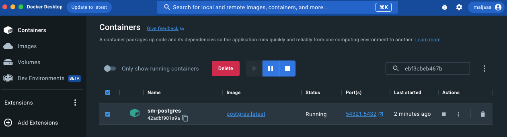
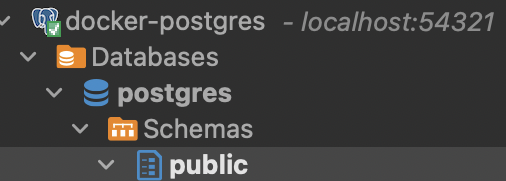

## Intro
회사에서 하는 일이 아닌, 개인 사이드 프로젝트를 시작했다.
어떤 서비스를 만들지 고민하고,
어떤 요구사항이 필요할지 정리했다.
그리고 세부 요구사항과 개발 스펙을 정리하면서 ERD를 작성했다.
ERD를 작성하고 나서는 뭘 해야할까?
DB를 구축해야할 것이다.
그래서 나는 로컬에서 간단하고 빠르게 실행하기 위하여 Docker에 Postgresql를 설치하고 실행했다.

## PostgreSQL 이미지 다운로드
가장 먼저 이미지를 다운로드 받아야 한다.
```
docker pull postgresql:latest
```

나는 버전에 상관없이 PostgerSQL을 사용할 수 있기 때문에 latest로 다운받았다.
만약 특정 버전이 필요하다면 :latest가 아니라 `:[version]`으로 작성하면 될 것이다. 

## 볼륨 생성
Docker Desktop에서도 생성이 가능하지만, 나는 명령어가 편하다.
```
docker volume create pgdata
```

## 컨테이너 실행
```
docker run --name sm-postgres -e POSTGRES_PASSWORD=[mysecretpassword] -p 54321:5432 -v pgdata:/var/lib/postgresql/data -d postgres:latest
```
* --name my-postgres : 컨테이너 이름 지정
* -e POSTGRES_PASSWORD : DB서버 패스워드 입력(필수), 나머지 환경 변수는 옵션이다. 자세한 내용은 [Docker Hub 페이지](https://hub.docker.com/_/postgres)에서 확인할 수 있다.
* -p 54321:5432 : 호스트 PC와 컨테이너 내부 PostgrSQL의 포트 바인딩. 나는 5432로 사용하고 있는 PostgreSQL이 있어서 54321로 해주었다. 나중에 54322 이렇게 구분을 지어 더 사용할 수도 있을 것 같다.
* -v pgdata:/var/lib/postgres/data : 생성해준 볼륨을 pgdata에 바인딩
* -d postgres:latest : 백그라운드에서 postgresql:latest 이미지를 사용해 컨테이너를 실행 


## PostgreSQL Server 설정
postgresql.conf와 pg_hba.conf 파일에는 이미 일부 설정되어 있다.
가장 많이 변경하는 listen_address는 디폴트 값이 localhost이지만 '*'로 설정되어 있다. 
Docekr Desktop으로 컨테이너 > Files > Actions > More > View Files를 클릭하면 설정할 수 있다.
명령어로는 
```
docer exec -it [container name] /bin/bash
```
여기서 파일을 수정할 수 있다.

## DBeaver 연결
난 DBeaver로 작업하는걸 좋아한다.
그래서 포트를 54321로 변경해주고, 아까 설정해줬던 비밀번홀르 작성하면 연결에 성공한다.


## 느낀점
Docker의 이미지를 활용해서 여러 서버들을 간단하게 로컬에서 돌리기 좋은 것 같다. 앞으로 이슈가 생긴다면 여기에 업로드하면 좋을 것 같다는 생각이 든다.

### 참고
[[PostgreSQL] Mac에 Docker로 PostgreSQL 설치 및 기본 설정하기](https://conceptbug.tistory.com/entry/PostgreSQL-Mac%EC%97%90-Docker%EB%A1%9C-PostgreSQL-%EC%84%A4%EC%B9%98%ED%95%98%EA%B8%B0)
```toc

```