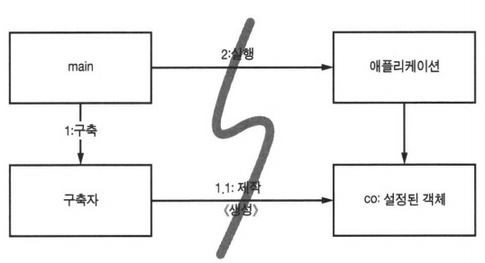

## Intro
```
"복잡성은 죽음이다. 개발자에게서 생기를 앗아가며, 제품을 계획하고 제작하고
테스트하기 어렵게 만든다."
- 레이 오지(Ray Ozzie, 마이크로소프트 최고 기술 책임자(CTO))
```
### 도시를 세운다면?
도시는 적절한 추상화와 묘율화로 돌아간다.  
그래서 큰 그림을 이해하지 않아도 개인과 개인이 관리하는 `구성요소`는 효율적으로 돌아간다.  
소프트웨어도 똑같다.  
깨끗한 코드는 낮은 추상화 수준에서 관심사를 분리하기 쉬워진다.  
이번엔 높은 추상화 수준, 즉 시스템 수준에서도 꺠끗함을 유지하는 방법을 알아보자!

### 시스템 제작과 시스템 사용을 분리하라
```
소프트웨어 시스템은 (애플리케이션 객체를 제작하고 의존성을 서로 '연결'하는) 준비 과정과
(준비 과정 이후에 이어지는) 런타임 로직을 분리해야 한다.
```
`관심사`를 분리해야한다.  
```java
public Service getService() {
    if (service == null)
        service = new MyServiceImpl(...);   // 모든 상황에 적합한 기본값일까?
    return service;
}
```
위와 같은 방법이 초기화 지연(Lazy Initialization) 혹은 계산 지연(Lazy Evaluation) 기법이다.  
* 장점  
    * 실제로 필요할 때까지 객체를 생성하지 않으므로 불필요한 부하가 걸리지 않는다.  
    * 따라서 애플리케이션을 시작하는 시간이 빨라진다.  
    * 어떤 경우에도 null 포인터를 반환하지 않는다.
* 단점  
    * getService 메서드가 MyServiceImpl과 생성자 인수에 명시적으로 의존한다.
    * 의존성을 해결하지 않으면 컴파일이 안된다.
    * MyServiceImpl이 무거운 객체라면 테스트 전용 객체(TEST DOUBLE, MOCK OBJECT)를 필드에 할당해야 한다.
    * service가 null인 경로와 null이 아닌 경로 모두 테스트해야 한다.
    * 작거네마 SRP를 깬다.
    * MyServiceImpl이 모든 상황에 적합한 객체인지 모른다.
    ... 등등

#### Main 분리
  
생성과 관련된 코드는 모두 main이나 main이 호출하는 모듈로 옮기고,
나머지 시스템은 모든 객체가 생성되었고 모든 의존성이 연결되었다고 가정하자.  
애플리케이션은 main이나 객체가 생성되는 과정을 전혀 모른다.  
#### 팩토리
  
객체가 생성되는 `시점`을 애플리케이션이 결정할 필요도 생긴다.  
저자는 주문처리 시스템을 예로 든다.  
애플리케이션은 LineItem 인스턴스를 생성해 Order에 추가한다.  
이때는 ABSTRACT FACTORY 패턴을 사용한다.  
그러면 `생성 시점`은 애플리케이션이 결정하지만, `생성 코드`는 모른다.

#### 의존성 주입
사용과 제작을 분리하는 강력한 메커니즘이다.  
`의존성 주입(Dependency Injection, DI)`은 `제어 역전(Inversion of Control, IoC) 기법`을 `의존성 관리`에 적용한 메커니즘이다.  
제어 역전에서는 한 객체가 맡은 **보조 책임**을 새로운 객체에게 전적으로 넘긴다.  
새로운 객체는 넘겨받은 책임만 맡으므로 SRP를 지키게 된다.  
대개 `책임질` 메커니즘으로 'main' 루틴이나 특수 컨테이너를 사용한다.  
  
```java
MyService myService = (MyService)(jndiContext.lookup("NameOfMyServiec"));
```
객체는 디렉터리 서버에 이름을 제공하고 그 이름에 일치하는 서비스를 요청한다.  
진정한 의존성 주입은 다음과 같다.  
1. 클래스는 완전히 수동적
2. 대신에 의존성 주입하는 방법으로 설정자(setter) 매서드나 생성자 인수 제공
3. DI 컨테이너는 인스턴스 만든 후 생성자 인수나 설정자 메서드 사용하여 의존성 설정
4. 실제로 생성되는 객체 유형은 설정 파일에서 지정하거나 특수 생성 모듈에서 코드로 명시

### 확장
`처음부터 올바르게` 시스템을 만들 수 있다는 믿음은 미신이다.  
새로운 스토리에 맞춰 시스템을 조정하고 확장하면 된다.  
이것이 반복적이고 점진적인 애자일 방식의 핵심이다.  
TDD, 리팩터링, 깨끗한 코드는 코드 수준에서 시스템을 조정하고 확장하기 쉽게 만든다.  
  
하지만 시스템 수준에서는 어떨까?  
```
"소프트웨어 시스템은 물리적인 시스템과 다르다. 관심사를 적절히 분리해 관리
한다면 소프트웨어 아키텍처는 점진적으로 발전할 수 있다.
```
비즈니스 논리가 덩치 큰 컨테이너와 밀접하게 결합되면 독자적인 단위 테스트가 어렵다.  
컨테이너를 흉내 내거나 많은 시간을 낭비하며 EJB와 테스트를 실제 서버에 배치해야 한다.  
그래서 EJB2 코드는 프레임워크 밖에서 재사용하기란 사실상 불가능하다.  
결국 OOP마저 흔들린다.  
그래서 우리는 DTO(Data Transfer Object)라는 반복적인 규격 코드가 필요하다.  

#### 횡단(cross-cutting) 관심사
`영속성`과 같은 관심사는 객체 경계를 넘나드는 경향이 있다.  
특정 DMBMS나 독자적인 파일을 사용하고, 테이블과 열은 같은 명명 관례를 따르며,  
트랜잭션 의미가 일관적이면 더욱 바람직하다.  
  
AOP(Aspect-Oriented Programming)는 횡단 관심사에 대처해 모듈성을 확보하는 일반적인 방법론이다.  
AOP에서 `관점(Aspect)`이라는 모듈 구성 개념은  
"특정 관심사를 지원하려면 시스템에서 특정 지점들이 동작하는 방식을 일관성 있게 바꿔야 한다."  
라고 명시한다.  

### 자바 프록시
자바 프록시는 단순한 상황에 적합하다.  
개별 객체나 클래스에서 매서드 호출을 감싸는 경우가 좋은 예다.  
저자는 Bank 애플리케이션에서 JDK 프록시를 사용해 영속성을 지원하는 예제를 살핀다.  
  
여기서 프록시로 감쌀 인터페이스 Bank와 비즈니스 논리를 구현하는 POJO(Plain Old Java Object) BankImpl을 정의했다.  
* 단점  
    * 깨끗한 코드 작성이 어렵다.  
    * 시스템 단위로 실행 '지점'을 명시하는 메커니즘을 제공하지 않는다.

### 순수 자바 AOP 프레임워크

### AspectJ 관점

### 테스트 주도 시스템 아키텍처 구축

### 의사 결정을 최적화하라

### 명백한 가치가 있을 때 표준을 현명하게 사용하라

### 시스템은 도메인 특화 언어가 필요하다

### 결론

```toc

```